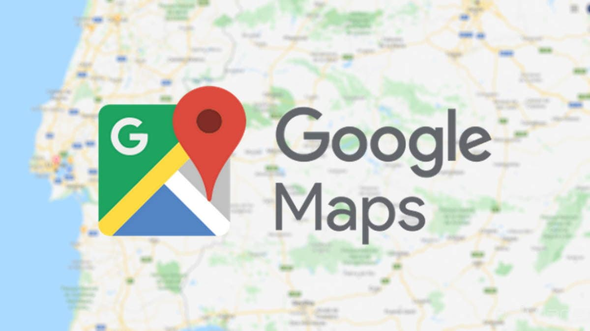

# Mapas De Google (Google Maps)
## 📍 ¿Qué es Google Maps?
**Mapas de google** es una herramienta de búsqueda de ubicaciones que permite geolocalizar un punto concreto, calcular rutas, encontrar lugares de interés más cercanos o ver la apariencia de un lugar a pie de calle.
## 📍 Origen
Se originó a partir de Where 2 Technologies, una empresa que se encargaba de mapear la ciudad de [Sídney en Australia](https://www.google.com/search?q=S%C3%ADdney&oq=S%C3%ADdney&gs_lcrp=EgZjaHJvbWUyDAgAEEUYORjjAhiABDIMCAEQLhgKGLEDGIAEMgcIAhAAGIAEMgkIAxAuGAoYgAQyFQgEEC4YChiDARivARjHARixAxiABDIJCAUQLhgKGIAEMhMIBhAuGIMBGK8BGMcBGLEDGIoFMg0IBxAuGIMBGLEDGIoFMg0ICBAuGIMBGLEDGIoF0gEHNDU1ajBqNKgCALACAA&sourceid=chrome&ie=UTF-8 "Sídney en Australia:"). Google compró su sistema de mapeo en 2004 para basar su nueva aplicación. De esta forma, fue anunciada en su Blog el 8 de febrero del 2005. Desde entonces, las políticas del programa han sido acertadas para los usuarios, permitiéndoles interactuar y al mismo tiempo ampliar sus horizontes en el mapa.
Al principio, solo podía ser utilizado por usuarios de [Internet Explorer](https://es.wikipedia.org/wiki/Internet_Explorer "Internet Explorer:") y [Mozilla Firefox](https://es.wikipedia.org/wiki/Mozilla_Firefox "Mozilla Firefox:"), pero unos días después, el 25 de febrero, pudo empezar a trabajar en [Opera](https://es.wikipedia.org/wiki/Opera_(navegador) "Opera:") y [Safari](https://es.wikipedia.org/wiki/Safari_(navegador) "Safari:").
## 📍 ¿Para qué sirve?
Google Maps es una herramienta multi uso que se utiliza para navegar, explorar, planificar viajes, buscar lugares y obtener información geográfica y de ubicación en tiempo real. Es una aplicación esencial para muchas personas en su vida diaria y viajes.

embed_youtube("JLMggr-4xQY") 

